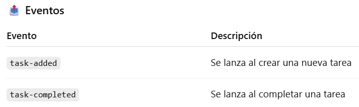
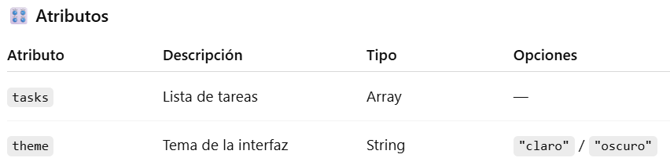

# 🗂️ ESPE Task Manager - LitElement

Este proyecto es una aplicación web de gestión de tareas encapsulada dentro de un **Web Component** llamado `<espe-task-list>` utilizando LitElement. Cumple con los lineamientos de accesibilidad, estilo, modularidad y reutilización propuestos por la ESPE.

---

## 🎯 Objetivo General

Transformar una aplicación de tareas en un **componente web reutilizable**, siguiendo buenas prácticas de desarrollo web con **LitElement**, incluyendo integración de estilos, lógica reactiva, accesibilidad, eventos personalizados y pruebas de compatibilidad.

---

## 🔧 Pasos Realizados en el Proyecto

### ✅ 1. Creación del Componente Web

- Se define el componente `EspeTaskList` extendiendo de `LitElement`.
- Se declaran las propiedades públicas (`tasks`, `theme`) y privadas (`showAddModal`, `editingTask`, etc.).
- Se registra el componente con `customElements.define`.

```js
export class EspeTaskList extends LitElement {
  static get properties() {
    return {
      tasks: { type: Array },
      theme: { type: String },
      ...
    };
  }

  constructor() {
    super();
    this.tasks = [];
    this.theme = 'claro';
    ...
  }
}
customElements.define('espe-task-list', EspeTaskList);
2. Encapsular Estilos en el Componente
Se migraron estilos desde styles.css hacia el bloque static styles.

Se usaron CSS Variables para definir colores acorde al Manual de Imagen ESPE.

Se adaptaron selectores al Shadow DOM (.modal → .modal, .task-item, etc).
static styles = css`
  :host {
    --color-primario: #00ff88;
    --color-fondo: #0d1d1d;
    ...
  }
  .modal { ... }
`;
3. Migración de la Lógica desde app.js
Se implementaron funciones dentro del componente:
guardarTarea(), editarTarea(), eliminarTarea(), completarTarea(), abrirModalDetalles(), cerrarModales(), etc.

Renderizado dinámico con map() en render().
guardarTarea() {
  if (!this.editingTask) {
    const newTask = { id: Date.now(), nombre: name, ... };
    this.tasks = [...this.tasks, newTask];
    this.dispatchEvent(new CustomEvent('task-added', {
      detail: { task: newTask },
      bubbles: true,
      composed: true,
    }));
  }
}

4. Integración del Componente en index.html
Se eliminó el HTML tradicional.

Se añadió el componente:

html
Copiar código
<espe-header></espe-header>
<espe-task-list theme="claro"></espe-task-list>
<script type="module" src="./components/espe-task-list.js"></script>

5. Implementación de Eventos Personalizados
Se emiten eventos como task-added y task-completed para comunicar acciones al exterior.

js
Copiar código
this.dispatchEvent(new CustomEvent('task-added', {
  detail: { task: newTask },
  bubbles: true,
  composed: true,
}));

6. Validación de Atributos y Accesibilidad
Validaciones:

tasks debe ser un arreglo.

theme debe ser "claro" u "oscuro".

Accesibilidad:

aria-label, role="dialog", navegación con teclado.

Contraste respetando WCAG.

js
Copiar código
<div class="modal" role="dialog" aria-modal="true" aria-labelledby="modal-title">

7. Pruebas y Depuración
Navegadores probados: Chrome, Firefox, Safari.

Se validaron flujos de usuario:

Agregar, editar, completar y eliminar tareas.

Evitar tareas vacías.

Uso de localStorage para persistencia.

js
Copiar código
if (!name) {
  alert('El nombre es obligatorio');
  return;
}
8. Documentación y Repositorio GitHub
Se añadió este README.md con toda la explicación.

Capturas en /docs.

Se creó una rama laboratorio1-todo-lit.




9. Preparación para Integración con Backend
Se documenta la posible conexión futura con una API REST:

js
Copiar código
async function fetchTasks() {
  const res = await fetch('/api/tasks');
  const data = await res.json();
  this.tasks = data;
}